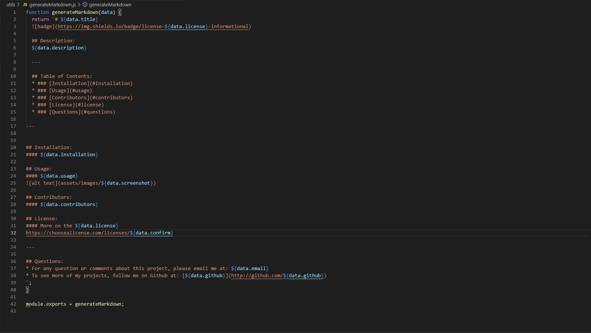

# README Generator
  

  ## Description:
  Generate a README.md file about your project by answering command line prompts.

  ---

  ## Table of Contents:
  * ### [Installation](#installation)
  * ### [Usage](#usage)
  * ### [Contributors](#contributors)
  * ### [License](#license)
  * ### [Questions](#questions)

---

  
## Installation:
#### Clone the Repository -> In the root folder, enter 'node index.js' in the command line and answer prompts -> README.md is generated.

## Usage:
#### To generate a README.md file.

### Video Walkthrough
[

## Contributors:
#### Fraser Thompson

## License:
#### More on the MIT license:
[MIT](https://opensource.org/licenses/MIT)

---

## Questions:
* For any question or comments about this project, please email me at: fraserjthompson@gmail.com
* To see more of my projects, follow me on Github at: [fthompson24](http://github.com/fthompson24)
